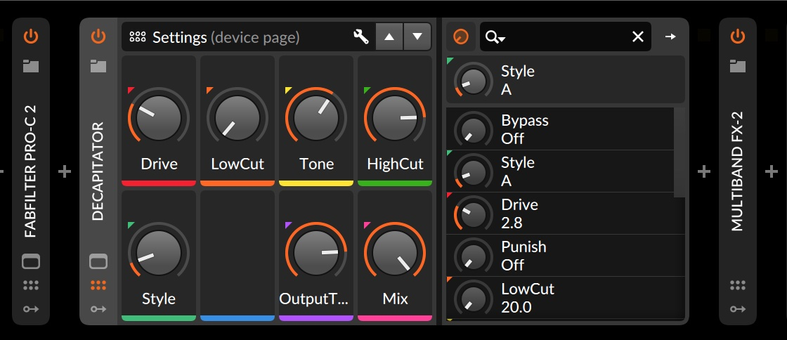
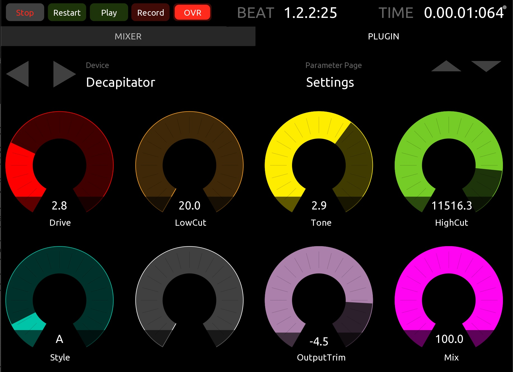
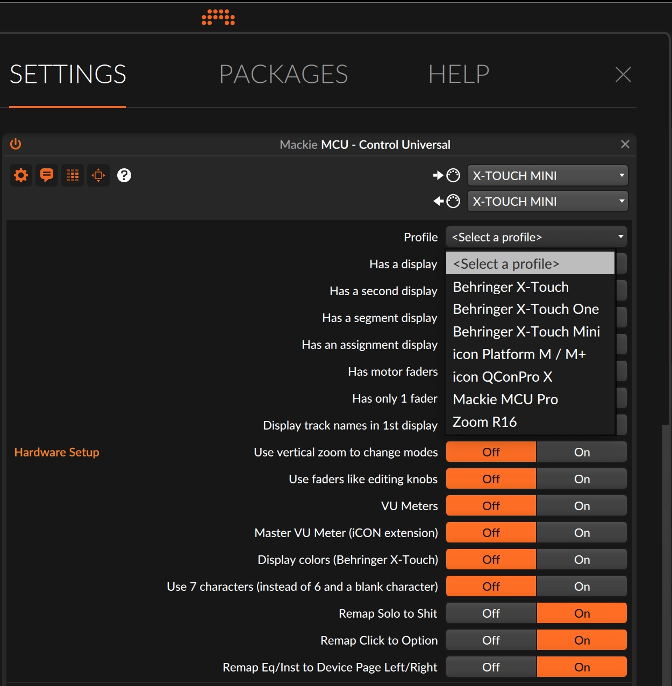
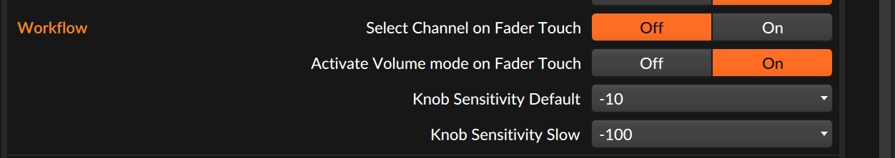

# DrivenByMoss - Fork with MCU support for remapping CLICK, SOLO and DEVICE EQ / INST buttons

I submitted a PR to Moss, but he doesn't own an xTouch Mini, and has a policy of not supporting what he doesn't own. Fair enough!

### There are two things that this repo offers:
 1. Ability to remap MCU controller CLICK, SOLO and DEVICE EQ / INST buttons to OPTION, SHIFT, and DEVICE Previous / Next page.
 2. A better-looking (to me) OSC app for Bitwig Mixer and Device.

## OSC Mixer and Device

I'll only show the image for the device page. What's nice about the mixer is that the individual track colors match the colors of your tracks in Bitwig, so they're easier to correlate and work with.

The device page will show the controls that you have mapped in Bitwig. For instance, selecting Decapitator

 will look like this on tablet, or whatever else you might be using to display:

...and your x-Touch Mini will look like this:

Tweaking the encoders on the Mini will also be reflected everywhere else. I like to map the sensitivity on the Mini to 100, so that the default encoder movements get you there fast, and to 10 when SHIFT is pressed, so that I can be very precise one close to what I want (see the following two pictures). This really speeds up my workflow

## Configuring the x-Touch Mini

In Bitwig Controller's page, add the x-Touch Mini as a new MCU - Control Universal, and if you're using this repo controller script, you'll have the X-Touch Mini Profilem, and the option to remap Click, Solo, Eq and Inst buttons.

In the X-Touch Mini picture, I'm also showing how I remapped the Drop and Replace buttons in Bitwig (see everything that's underlined). With these button mappings, I find the X-Touch Mini more useful than the Mackie MCU (which I've sold since I got all this working)

..and finally here is the sensitivity configuration that enables quick encoder movements, and precise control when the SHIFT button is pressed.

Hope you find this useful. If questions, ask on Reddit, r/Bitwig, and hopefully somebody will help out.

HUGE thanks to DrivenByMoss for making all this possible!!!! (and maybe he should get the X-Touch Mini ;)
-arnox
