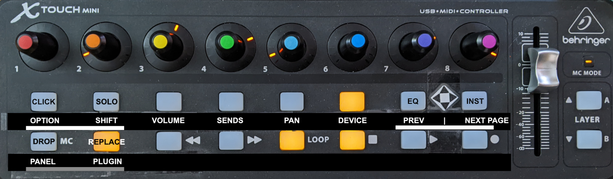

# MCU X-Touch Mini support, and a new OSC app

I submitted a PR to Moss, but he doesn't own an X-Touch Mini, and has a policy of not supporting what he doesn't own. Fair enough!

### There are two things that this repo offers:
 1. The ability to remap MCU controller CLICK, SOLO and DEVICE EQ / INST buttons to OPTION, SHIFT, and DEVICE Previous / Next page (controller restart in Bitwig required - toggle the 'Power' button on the controller pane)
 2. A better-looking (to me) OSC app for Bitwig Mixer and Device.

## OSC app with Mixer and Plugin/Device pages

I'll only show the image for the device page. What's nice about the mixer is that the individual track colors match the colors of your tracks in Bitwig, so they're easier to correlate and work with.

The device page will show the controls that you have mapped in Bitwig. For instance, selecting Decapitator (the way I have it mapped)

 will look like this on your OSC device:

...and your X-Touch Mini will look like this:

Tweaking the encoders on the Mini will also be reflected everywhere else, as you'd expect.

## Configuring the X-Touch Mini

In Bitwig's Controllers page, add the X-Touch Mini as a new "MCU - Control Universal", and if you're using this repo's controller script, you'll have the X-Touch Mini profile, and the option to remap Click, Solo, Eq and Inst buttons.

In the X-Touch Mini picture, I'm also showing how I remapped the Drop and Replace buttons in Bitwig (all underlined). With these button mappings, I find the X-Touch Mini more useful and faster to work with than the Mackie MCU (which I've sold since I got all this working)

..and a final tip! I like to map the sensitivity on the Mini encoders to 100, so that the default encoder movements get you there fast, and to 10 when SHIFT is pressed, so that I can be very precise one close to what I want (see the following two pictures). This really speeds up my workflow

Hope you find this useful. If questions, ask on Reddit, r/Bitwig, and hopefully somebody will help out.

HUGE thanks to DrivenByMoss for making all this possible!!!! (and maybe he should get the X-Touch Mini ;)
-arnox
